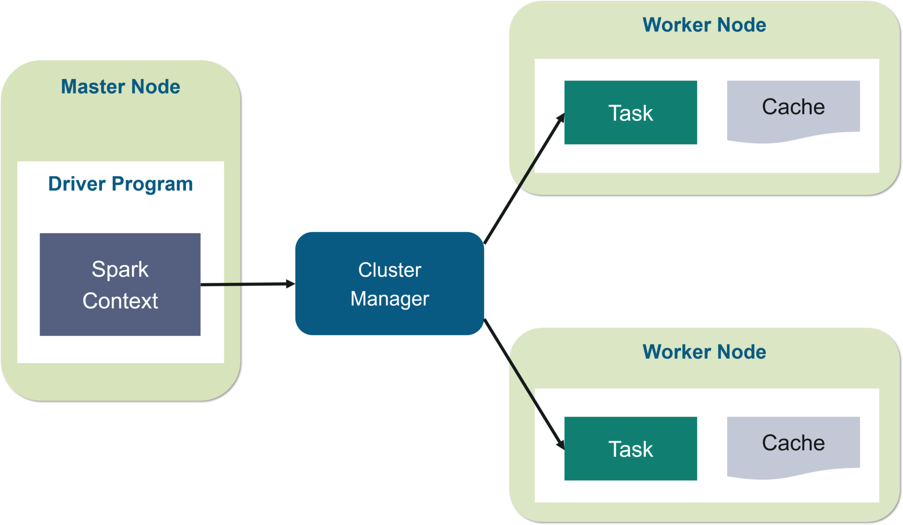
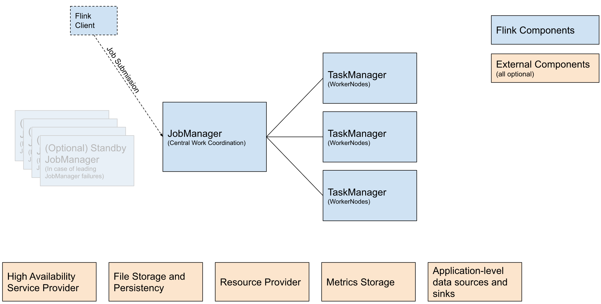

Apache Spark 和 Apache Flink 是当前最主流的分布式计算引擎，二者都支持批处理（Batch Processing）和流处理（Stream Processing），在 API 设计、执行架构和任务调度等方面存在诸多相似之处。网上的教程很多都是在比较两者的差别，那强哥今天进来说说他们的相似点。如果开发者已经熟悉其中之一，可以通过类比快速上手另一个。  

本文将重点分析 **架构组件** 的相似性，并从 **API 设计、流批处理逻辑** 等角度对比 Spark 和 Flink，帮助开发者快速理解和迁移。  

---

## 1. 架构组件对比

Spark 和 Flink 的架构设计有许多共同点，比如都采用了 **主从结构（Master-Slave）**，都具备 **任务调度、资源管理、数据存储和计算执行** 等核心组件。但两者在 **执行模式、调度策略、资源管理方式** 上有所不同。  

### **1.1 整体架构对比**  

| **组件**       | **Spark**                                      | **Flink**                                      |
|---------------|----------------------------------------------|----------------------------------------------|
| **集群管理**  | Spark Standalone / YARN / Kubernetes / Mesos | Flink Standalone / YARN / Kubernetes        |
| **主节点**    | Driver（应用程序主控）                      | JobManager（任务调度与协调）                |
| **工作节点**  | Executor（执行任务的计算节点）               | TaskManager（执行 Task 的工作节点）         |
| **任务调度**  | 基于 DAG 计算图，Stage 划分 Task 并调度执行   | 事件驱动的流式任务调度，Pipeline 计算图     |
| **存储系统**  | HDFS / S3 / Delta Lake                        | HDFS / S3 / RocksDB（状态存储）              |

两者的架构在 **主从架构、任务调度方式、资源管理** 上存在明显的类比关系，我们逐一拆解其核心组件。  

spark架构图：


flink架构图：


---

### **1.2 组件详细解析**  

#### **（1）主控节点（Master）**
| **Spark Driver** | **Flink JobManager** |
|------------------|---------------------|
| 负责解析 Spark 应用程序，构建 DAG 任务执行图 | 负责解析 Flink 作业，构建 Streaming 计算图 |
| 任务按照 Stage 进行划分，每个 Stage 内部有多个 Task | 任务按照 Operator 进行划分，每个 Operator 可以并行执行多个 Task |
| 任务调度依赖 YARN/Kubernetes 或 Spark Standalone | 任务调度由 JobManager 直接管理 |
| 资源分配方式：Driver 向集群请求 Executor | 资源分配方式：JobManager 请求 TaskManager |

**核心区别**：
- **Spark 的 Driver 是单点的，任务执行的 DAG 依赖 Driver 维护**，如果 Driver 挂掉，任务失败。
- **Flink 的 JobManager 支持高可用（HA）模式，可主备切换**，不会因主控故障导致任务失败。

---

#### **（2）计算执行节点（Worker）**
| **Spark Executor** | **Flink TaskManager** |
|--------------------|----------------------|
| 每个 Executor 运行多个 Task，Task 共享 Executor 进程 | 每个 TaskManager 运行多个 Task Slot，每个 Task Slot 承载一个 Task |
| 任务以 RDD 形式存储在内存中，默认情况下不会持久化状态 | 任务可以管理状态，存储在 RocksDB 等存储引擎中 |
| 计算任务在 Executor 内部进行批处理 | 计算任务在 TaskManager 内部进行流式计算 |
| 如果 Executor 挂掉，该 Executor 上的 Task 需要重新调度 | TaskManager 支持故障恢复，状态可自动回放 |


>
---

#### **（3）任务调度**
| **Spark DAG 调度** | **Flink Streaming Graph 调度** |
|--------------------|------------------------------|
| 任务被拆分为多个 Stage，每个 Stage 内部执行多个 Task | 任务被拆分为 Operator，每个 Operator 由多个 Task 组成 |
| Task 之间的数据传输是基于 Shuffle 的 | Task 之间的数据传输是流式传输 |
| 任务执行是 **批处理优先**，流处理采用微批（Micro-batch）方式 | 任务执行是 **流处理优先**，事件驱动（Event-driven） |
| Stage 执行完毕后，下一 Stage 才能执行 | Operator 之间可以持续流动，不需要等待批次结束 |

---

## 2. API 设计对比：DataFrame / DataSet  

Spark 和 Flink 都提供了高层级的 **Table API & SQL**，以及低层级的 **DataFrame / DataSet / DataStream API**。

### **示例对比**
**Spark DataFrame API 示例**
```scala
val spark = SparkSession.builder().appName("SparkExample").getOrCreate()
val df = spark.read.json("data.json")
df.select("name", "age").filter($"age" > 18).show()
```

**Flink Table API 示例**
```scala
val env = ExecutionEnvironment.getExecutionEnvironment
val tableEnv = BatchTableEnvironment.create(env)
val table = tableEnv.readJson("data.json")
table.select("name", "age").filter($"age" > 18).execute()
```

---

## 3. 流批处理逻辑对比  

Spark 和 Flink **都支持批处理和流处理**，但执行方式不同：
- **Spark 的流处理基于微批（Micro-Batch）**，每隔一定时间处理一批数据。
- **Flink 是真正的流处理（Event-driven）**，每条数据到达就立即处理。  

### **示例对比**
**Spark Structured Streaming**
```scala
val spark = SparkSession.builder().appName("StreamExample").getOrCreate()
val streamDF = spark.readStream.format("kafka").option("subscribe", "topic").load()
streamDF.writeStream.outputMode("append").format("console").start()
```

**Flink DataStream**
```scala
val env = StreamExecutionEnvironment.getExecutionEnvironment
val stream = env.addSource(new FlinkKafkaConsumer[String]("topic", new SimpleStringSchema(), props))
stream.print()
env.execute()
```

---

## 4. 结论  

| **对比维度** | **Spark** | **Flink** |
|-------------|----------|----------|
| **批处理** | RDD / DataFrame / Dataset | DataSet / Table API |
| **流处理** | Structured Streaming（微批） | DataStream（事件驱动） |
| **计算模型** | DAG 任务执行 | Pipeline 任务执行 |
| **时间处理** | 主要基于 Processing Time | 支持 Event Time & Processing Time |
| **状态管理** | 依赖外部存储（如 HDFS, Delta Lake） | 内置 RocksDB 状态存储 |

如果你已经掌握 Spark：
- 可以用 Flink Table API 处理批任务，类似 Spark SQL。
- Flink DataStream 需要适应事件驱动模式，但 API 设计很类似。
- 架构组件（Driver / JobManager, Executor / TaskManager）有明显对应关系，学习曲线较低。  

**总的来说，Spark 更适合批处理，Flink 更擅长流处理**。二者 API 设计相似，掌握一个后，迁移到另一个并不困难！